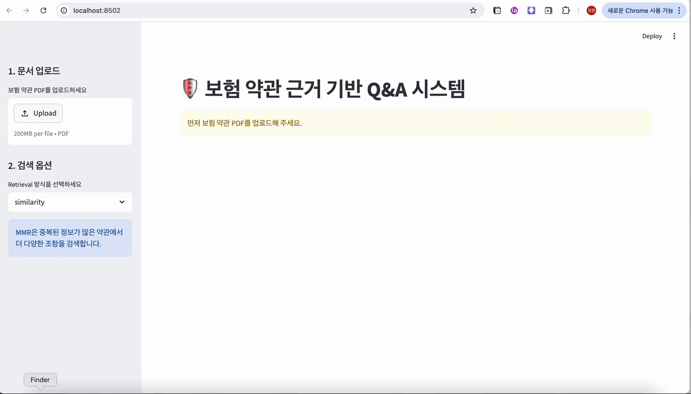

# 🛡️ 보험 약관 기반 챗봇

> 보험 약관 PDF를 분석하여 질문에 대한 정확한 답변과 함께 **근거 조항 및 페이지**를 제시하는 신뢰형 RAG 시스템입니다.

---
## DEMO




---

## 1. 🎯 프로젝트 개요 (Background)
보험 약관은 수백 페이지에 달하는 방대한 분량과 난해한 용어로 인해 고객이 원하는 정보를 찾기 매우 어렵습니다. 
일반적인 LLM은 약관에 없는 내용을 지어내는 **할루시네이션(Hallucination)** 위험이 있어 실제 금융 서비스에 적용하기에는 신뢰성 문제가 존재합니다.

본 프로젝트는 이러한 문제를 해결하기 위해 **모든 답변은 반드시 약관 내 근거를 가져야 한다**는 원칙 하에 설계되었습니다. 
특히 보험사의 핵심 가치인 **데이터 보안 문제**를 고려하여 로컬 환경에서 구동 가능한 시스템을 구축하는 데 집중했습니다.

---

## 2. 📐 시스템 아키텍처 (Architecture)


1.  **Document Ingestion**: `PyMuPDF`를 활용해 표와 계층 구조를 유지하며 약관 로드.
2.  **Preprocessing**: 보험 문맥을 유지할 수 있도록 `RecursiveCharacterTextSplitter`로 최적의 청크 분할.
3.  **Vectorization**: `multilingual-e5-small` 모델을 통해 한국어 보험 용어의 의미를 벡터화.
4.  **Retrieval Strategy**: 단순 유사도 검색을 넘어 정보의 다양성을 보장하는 **MMR(Maximum Marginal Relevance)** 기법 적용.
5.  **Generation**: **Llama 3.1 (Local)** 또는 Gemini API를 연동하여 근거 기반 답변 생성.

---

## 3. 🛠️ 핵심 기술 스택 (Tech Stack)

- **Framework**: LangChain (v0.3)
- **LLM**: Ollama / Llama 3.1 (Local Security Focus)
- **Embedding**: HuggingFace `intfloat/multilingual-e5-small`
- **Vector DB**: ChromaDB
- **UI**: Streamlit
- **PDF Engine**: PyMuPDF (Fitz)

---

## 4. 🚀 핵심 차별화 포인트 (Key Differentiation)

### ✅ 금융 도메인 맞춤형 PDF 전처리
보험 약관은 표(Table)에 핵심 보장 내용이 담겨 있는 경우가 많습니다. 본 프로젝트는 `PyPDF` 대신 표 인식률이 높고 속도가 빠른 **PyMuPDF**를 채택하여 데이터 누락을 최소화했습니다.

### ✅ On-device 보안 강화 (Privacy-First)
보험사는 고객의 민감한 질의 데이터를 외부 서버로 전송하는 것에 보수적입니다. 이를 반영하여 **Mac M 시리즈의 가속(MPS)을 활용하는 Ollama(Llama 3.1)** 환경을 구축함으로써, 오프라인 환경에서도 안전하게 작동하는 RAG 시스템을 구현했습니다.

### ✅ 답변 근거 추적 (Explainability)
단순 답변을 넘어, 해당 답변이 약관의 **몇 페이지**에서 발췌되었는지를 사용자에게 시각적으로 제시합니다. 이는 AI 답변에 대한 사용자의 신뢰도를 획기적으로 높여줍니다.

---

## 5. 📊 성능 평가 (Evaluation)
자체적으로 구성한 보험 질의 데이터셋을 바탕으로 검색 및 답변 정확도를 테스트했습니다.

| 사용자 질문 | 기대 조항 (Ground Truth) | 검색 페이지 | 답변 정확도 |
| :--- | :--- | :--- | :--- |
| 암 진단비 지급 사유가 뭐야? | 제12조 (암의 정의) | p.15 | ✅ 정확 |
| 보험금을 안 주는 경우도 있어? | 제5조 (지급하지 않는 사유) | p.22 | ✅ 정확 |

---

## 6. 💻 실행 방법 (How to Run)

```bash
# 1. 가상환경 활성화
source venv/bin/activate

# 2. 필수 라이브러리 설치
pip install -r requirements.txt

# 3. 로컬 모델 실행
ollama run llama3.1

# 4. 앱 실행
streamlit run app.py

---

## 7. 📡 배포 버전 (Deployment Vers.)

### Local Version
로컬 환경에서는 Ollama / Llama 3.1을 연동하여 검색된 약관 context를 기반으로 자연어 답변을 생성하는 RAG 구조를 구현했습니다.

### Streamlit Cloud Demo Version
Streamlit Cloud 배포 환경에서는 Ollama 서버 실행이 제한되므로, LLM 답변 생성 대신 검색된 약관 조항과 source/page 근거를 반환하는 retrieval-based Q&A demo로 구성했습니다.
